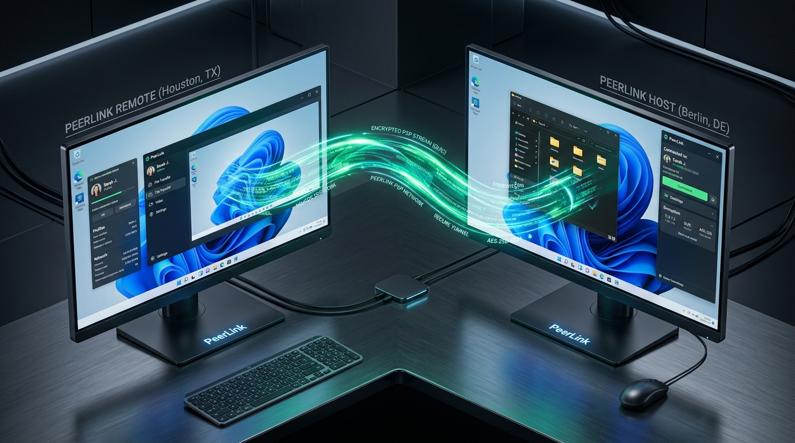
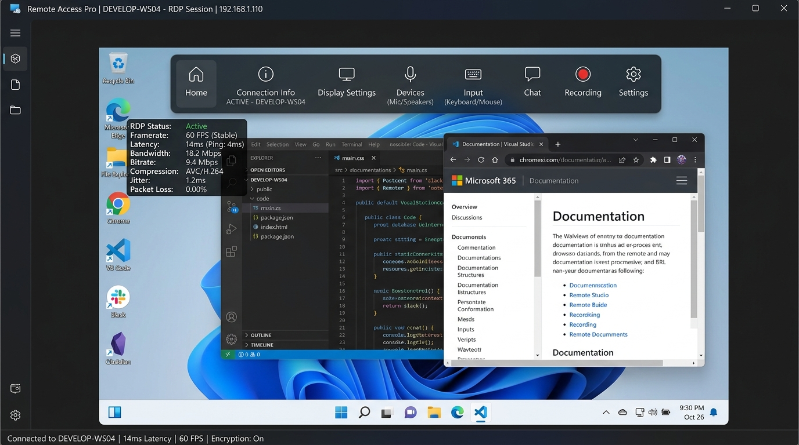
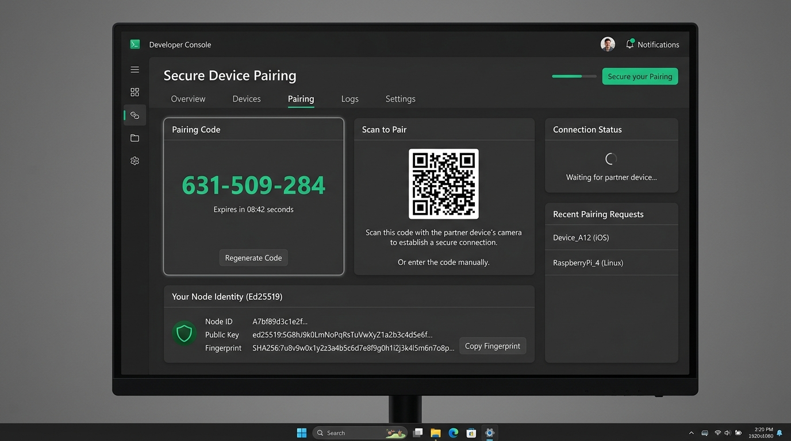
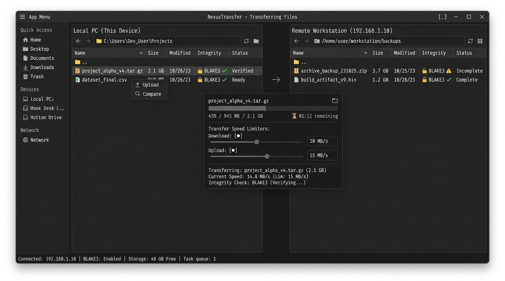

# PeerLink — Peer-to-Peer Remote Desktop for Windows

<div align="center">



**Encrypted, direct peer-to-peer remote desktop for Windows with QUIC/iroh transport, zero-knowledge directory pairing, hardware-accelerated video pipeline, and resumable BLAKE3 file transfer.**

[](LICENSE)
[](https://microsoft.com/windows)
[-emerald.svg)](https://iroh.computer)
[-amber.svg)](#security-architecture)
[-orange.svg)](#untrusted-cloudflare-worker-pairing)

[Features](#key-features) • [Architecture](#system-architecture) • [Pairing Flows](#pairing--zero-knowledge-directory) • [Media Pipeline](#low-latency-media-pipeline) • [Security](#security--audit-trail) • [Getting Started](#getting-started)

</div>

---

## Overview

**PeerLink** connects two Windows PCs directly using an encrypted peer-to-peer QUIC transport. There are **no company-operated video servers, no user accounts, and no central telemetry databases**. Devices are identified purely by cryptographic Ed25519 public keys, paired once, and reconnect automatically.

When a direct UDP path cannot be hole-punched due to symmetric NAT or CGNAT, PeerLink falls back to stateless, end-to-end-encrypted relays that forward only ciphertext.

---

## Screenshots

<div align="center">

### Interactive Remote Desktop Viewer

*Windows 11 remote desktop viewer with auto-hiding Fluent pill toolbar, live telemetry HUD (60 FPS, 14ms latency), and interactive desktop applications.*

<br/>

| Zero-Knowledge Pairing Screen | Resumable iroh-blobs File Manager |
|:---:|:---:|
|  |  |
| *9-digit split short-code pairing with PAKE mutual key exchange* | *Dual-pane explorer with BLAKE3 cryptographic integrity checks* |

</div>

---

## Key Features

- ⚡ **Zero-Server Video Stream**: Direct UDP hole punching (~90% success rate via QUIC NAT traversal) with encrypted stateless relay fallback. No corporate broker ever receives or decodes your video.
- 🔑 **Untrusted Cloudflare Worker + DO Directory**: Convenient 9-digit short-code pairing (`482-915-370`) without trusting the directory server. The first 6 digits (`482-915`) query the host's NodeID; the remaining 3 digits (`370`) are never sent to the Worker and are used exclusively in direct channel-bound PAKE (SPAKE2/CPace) mutual key confirmation.
- 🖥️ **Hardware-Accelerated Video**: DXGI Desktop Duplication (DDA) directly on GPU textures, hardware H.264 / HEVC / AV1 encode via Media Foundation MFTs (NVENC, AMD AMF, Intel oneVPL), and D3D11 flip-model presentation with waitable swap chains.
- 🔤 **Chroma 4:4:4 Crisp Text Refinement**: Intelligent dirty-rect analysis sharpens static screen areas with uncompressed sub-sampling ~150ms after motion ceases.
- 📁 **Resumable File Transfers (iroh-blobs)**: Content-addressed transfers verified via BLAKE3 hashes. Resumes across disconnects and reboots without re-hashing from scratch, and applies Windows Mark-of-the-Web (`Zone.Identifier:3`) for download sandboxing.
- 🛡️ **Three-Process Privilege Separation**:
  - `peerlink.exe --service`: Broker running in Session 0 (SYSTEM) with **zero network sockets**, managing user sessions and launching agents.
  - `peerlink.exe --net`: Low-privilege process holding the iroh QUIC endpoint and unauthenticated TLS handshake logic.
  - `peerlink.exe --agent`: SYSTEM process inside the interactive user desktop handling DDA capture, UAC prompts, and input injection.
- 🛑 **Tamper-Evident Hash Chain Audit Log**: Append-only security audit log where every event cryptographically chains the hash of its predecessor.
- 🚨 **Emergency Panic Disconnect**: Instant panic hotkey (`Ctrl+Alt+Shift+Pause`) that immediately severs the connection, releases all virtual keys/modifiers, and locks the host screen.

---

## System Architecture

```
  CONTROLLER PC                                         HOST PC (controlled)
 ┌──────────────────────────┐                          ┌───────────────────────────────────────┐
 │ UI (Tauri 2 / WebView2)  │                          │ Broker (service, SYSTEM, no sockets)  │
 │  ├ Controller Dashboard  │                          │   │ spawns & monitors                 │
 │  ├ Live Session Viewer   │                          │   ▼                                   │
 │  └ Dual-Pane File Mgr    │   QUIC/TLS1.3 (iroh)     │ Net (restricted token)                │
 │ iroh Endpoint (in-proc)  │◄════════════════════════►│   iroh endpoint, pairing, authz       │
 └──────────────────────────┘  Direct UDP (QNT) or     │         ▲ (named pipe IPC)            │
                               Stateless Encrypted     │         ▼                             │
                               iroh Relay              │ Agent (SYSTEM in session)             │
                                                       │   ├ capture (DXGI Desktop Dup)        │
                                                       │   ├ encode (Media Foundation HW)      │
                                                       │   ├ input injection (SendInput)       │
                                                       │   └ clipboard & audio (WASAPI)        │
                                                       │ Host UI: persistent floating pill     │
                                                       └───────────────────────────────────────┘
```

---

## Pairing & Zero-Knowledge Directory

PeerLink provides three pairing modes:

### Flow A: Invite Ticket / QR Code (High-Entropy)
Generates a `peerlink://pair/{NodeID}?token={Secret}&relay={Relay}` URI containing a 128-bit single-use token and a 10-minute expiry window. Scanned via QR or pasted directly.

### Flow B: 9-Digit Split Code (Untrusted Cloudflare Worker + DO)
1. Host generates 9-digit code: `482-915-370`.
2. **First 6 digits (`482-915`)**: Sent to a lightweight Cloudflare Worker & Durable Object directory as the lookup index for the host's Ed25519 NodeID and relay hint.
3. **Last 3 digits (`370`)**: **NEVER transmitted to the Worker or any server.** Kept strictly on the host and controller.
4. The controller dials the host over direct QUIC and executes a Password-Authenticated Key Exchange (**PAKE**, SPAKE2 or CPace) channel-bound to the TLS session exporter using `370`.
5. **Security Result**: Even if the Cloudflare Worker or its SQLite database is compromised, the attacker cannot MITM or decrypt the session because they lack the PAKE secret.

### Flow C: Local LAN Auto-Discovery (mDNS)
Devices on the same local network broadcast an mDNS beacon. Peers appear in the local discovery list with zero external network access.

---

## Low-Latency Media Pipeline

| Pipeline Stage | Technology | Latency Target |
|---|---|---|
| **Capture** | DXGI Desktop Duplication (DDA) with dirty rect tracking | 1–4 ms |
| **Color Convert** | Compute Shader BGRA $\to$ NV12 / P010 (GPU-resident) | < 1 ms |
| **Encode** | Media Foundation HW MFT (AV1 / HEVC / H.264) | 2–8 ms |
| **Transport** | Stream-per-frame unidirectional QUIC streams + deadline reset | RTT / 2 |
| **Decode** | D3D11 Video Decoder / DXVA | 2–6 ms |
| **Present** | Flip-model swap chain (`DXGI_SWAP_EFFECT_FLIP_DISCARD`) | $\le$ 1 vsync |
| **Total Glass-to-Glass** | **LAN $\le$ 50 ms @ 60 FPS · WAN $\approx$ RTT/2 + 40 ms** |

---

## Security & Audit Trail

- **Default-Deny Access Matrix**: Every paired peer has an individual cryptographic grant:
  `VIEW` • `CONTROL` • `CLIPBOARD_READ` • `CLIPBOARD_WRITE` • `FILES_SEND` • `FILES_RECEIVE` • `FILES_BROWSE` • `AUDIO` • `ELEVATED` • `POWER` • `RECORD` • `UNATTENDED`
- **Tamper-Evident Audit Chain**: Security events are recorded into an append-only block ledger:
  $$\text{Hash}_n = \text{BLAKE3}(\text{Hash}_{n-1} \parallel \text{Timestamp} \parallel \text{PeerNodeID} \parallel \text{Payload})$$
  Any post-facto modification invalidates the cryptographic verification badge.
- **Short Authentication String (SAS)**: Displays 4 visual verification words and emojis derived from the TLS session exporter to eliminate MITM risk:
  `anchor · cobalt · harbor · zenith` 🚀💎⚡

---

## Comparison Matrix

| Feature | PeerLink | AnyDesk / TeamViewer | RustDesk | Windows RDP |
|---|:---:|:---:|:---:|:---:|
| **Serverless Video** | ✅ Direct QUIC / iroh | ❌ Cloud Broker | ⚠️ Needs self-hosted `hbbs`/`hbbr` | ❌ Inbound port required |
| **Account Required** | ❌ None (Key-based) | ✅ Mandatory accounts | ❌ Optional | ❌ Windows accounts |
| **Short-Code Pairing** | ✅ Split-Code (Worker DO) | ⚠️ Centralized server | ⚠️ Centralized relay | ❌ IP / Hostname only |
| **Encrypted Relay** | ✅ Stateless (Ciphertext only) | ❌ Proprietary cloud | ⚠️ Self-hosted | ❌ No built-in relay |
| **Process Isolation** | ✅ Broker + Net + Agent | ❌ Monolithic service | ⚠️ Service + Client | ✅ OS-level |
| **Resumable Files** | ✅ BLAKE3 (iroh-blobs) | ⚠️ Basic chunking | ⚠️ Basic chunking | ⚠️ SMB / RDP clip |
| **Audit Log** | ✅ Cryptographic Hash Chain | ⚠️ Plain text log | ⚠️ Server database | ⚠️ Windows Event Log |

---

## Getting Started

### Prerequisites
- Windows 10 22H2 / Windows 11 (x64)
- Node.js 20+ and Rust 1.80+ (for native compilation)

### Running the Web / Desktop Client

```bash
# Clone the repository
git clone https://github.com/Darkphoenixir/PeerLink-Peer-to-Peer-Remote-Desktop-for-Windows.git
cd PeerLink-Peer-to-Peer-Remote-Desktop-for-Windows

# Install dependencies
npm install

# Start development preview
npm run dev
```

### Hotkeys & Shortcuts
- `Ctrl + Alt + Shift + Pause` (or `Q`): **Emergency Panic Stop** (instantly severs QUIC link and releases virtual keys).
- Top toolbar: Switch monitors, adjust quality presets (Auto ABR, Speed, Balanced, Quality, Data Saver), toggle laser pointer / highlighter, or inspect 4:4:4 subpixels.

---

## License

Dual-licensed under the **MIT License** and **Apache License 2.0**.
Third-party libraries: iroh (Apache 2.0 / MIT), OpenH264 (BSD 2-Clause), BLAKE3 (Apache 2.0 / CC0).
No GPL or AGPL components are linked or distributed in the production binary.
